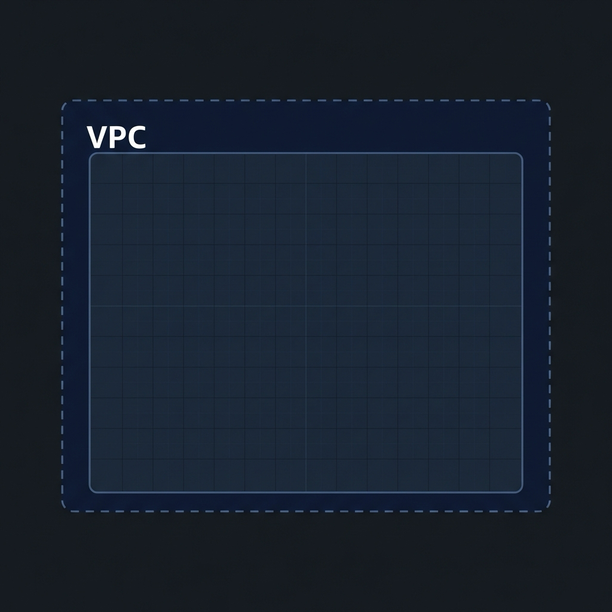
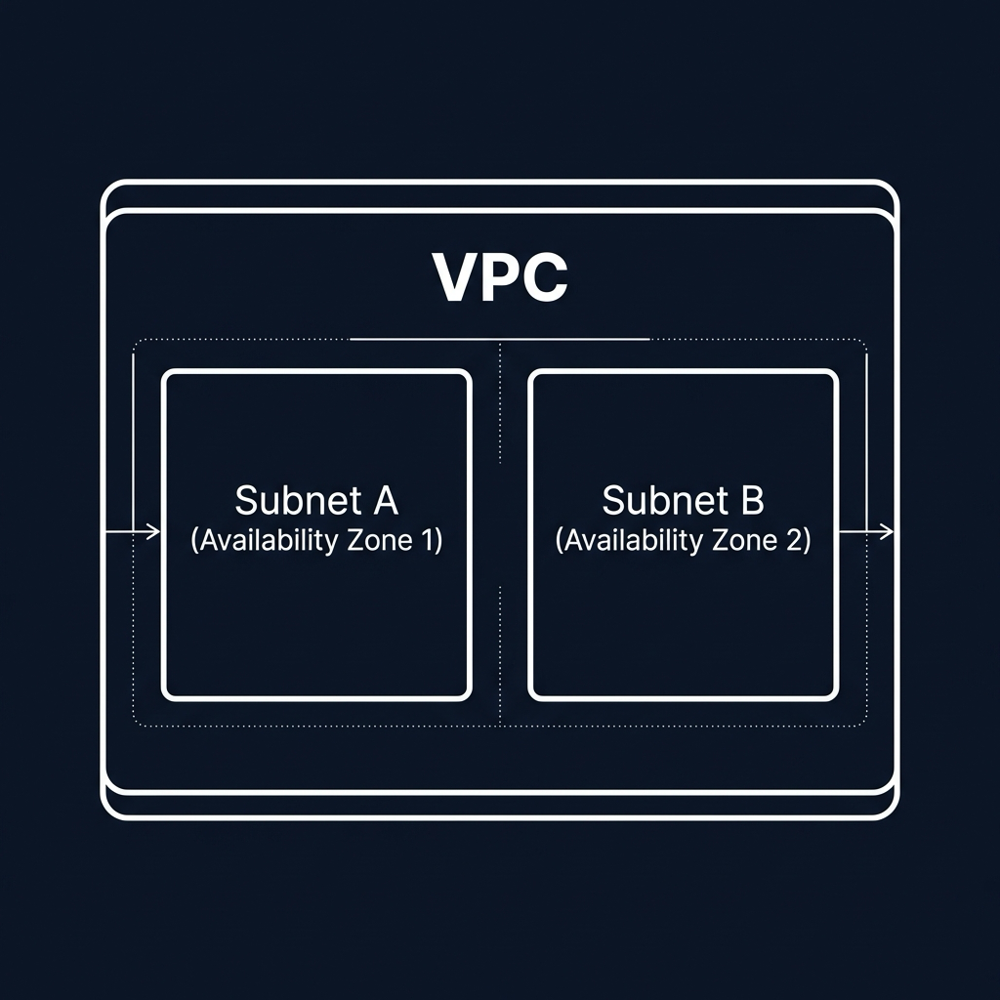
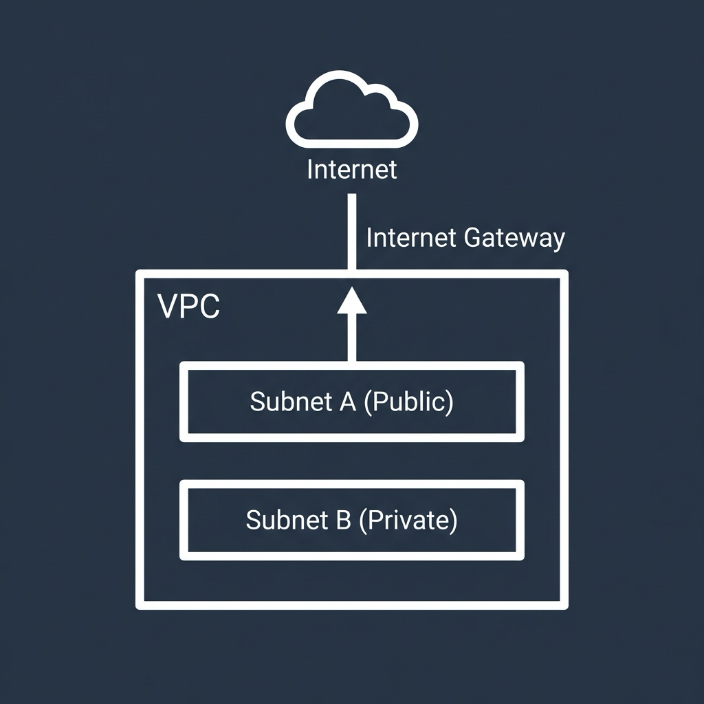
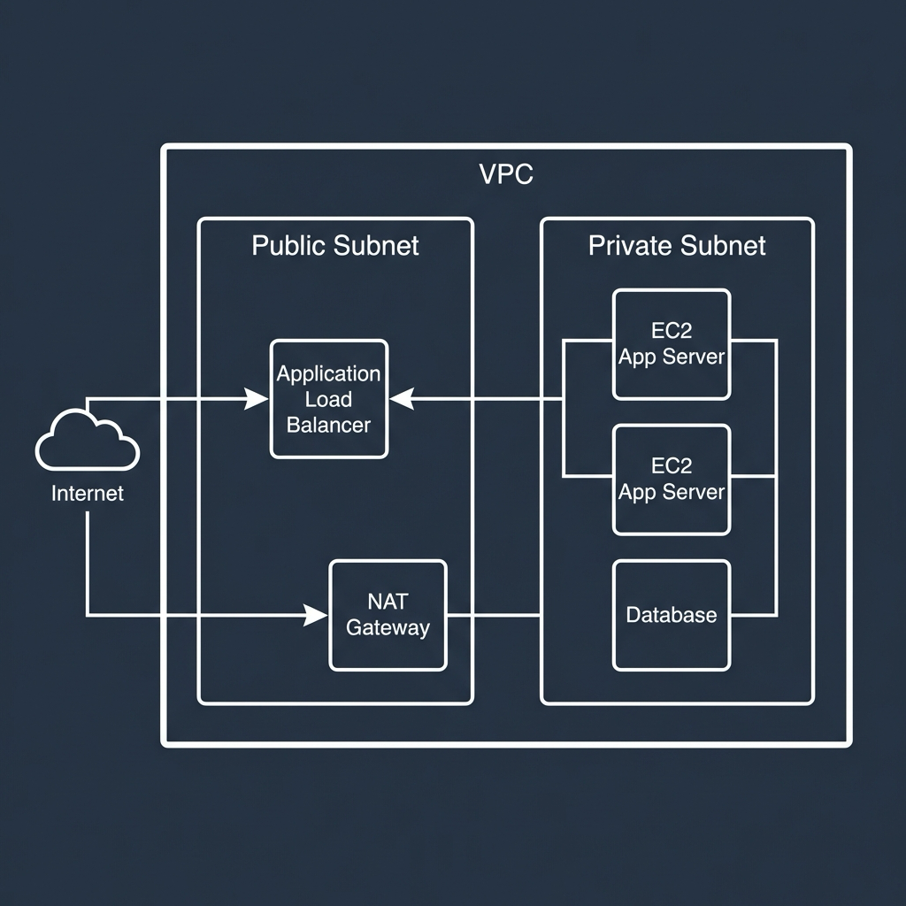
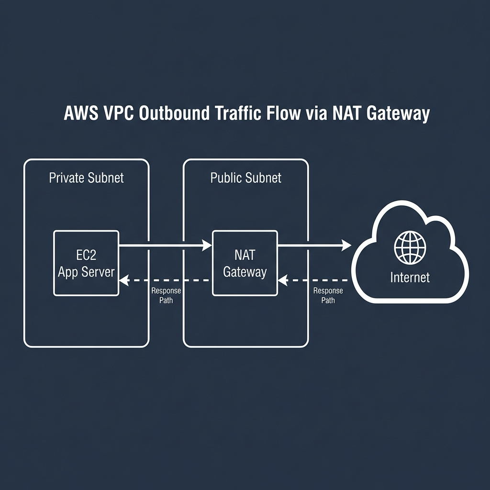
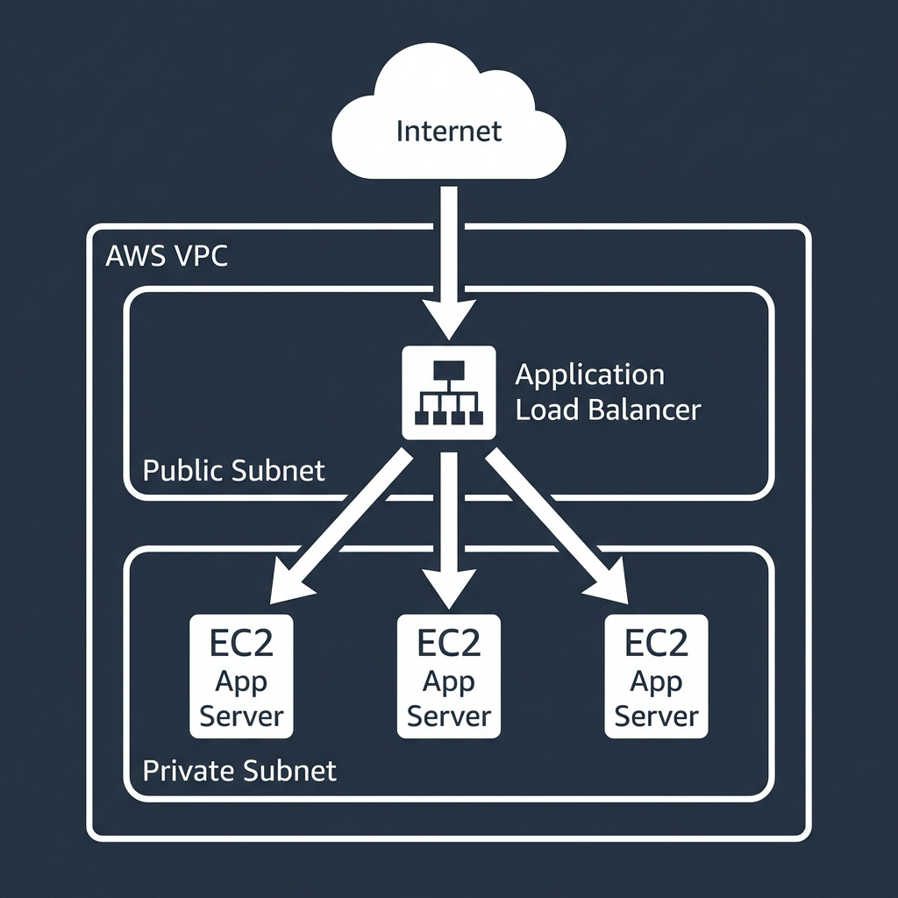
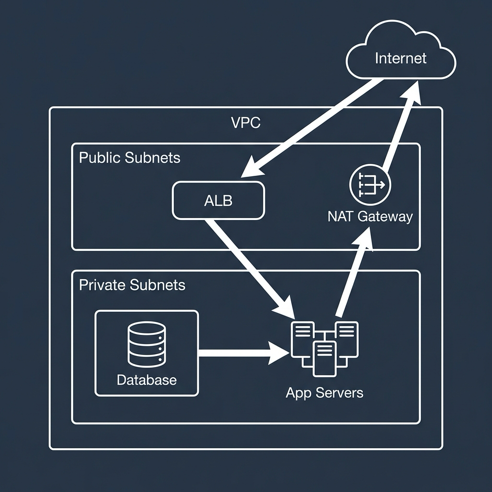

## Public vs Private Subnets in AWS: What Goes Where and Why

_Written by_ [Demola Malomo](https://github.com/Mr-Malomz)

When people first start working with AWS networking, subnets often feel abstract. Public, private, route tables, gateways. It is easy to follow a tutorial and end up with something that works, without really understanding why resources were placed where they were.

Once you understand the difference between public and private subnets, many AWS architecture decisions start to feel obvious rather than arbitrary.

This distinction is not about memorizing rules. It is about understanding what each part of your system is meant to do.

That understanding starts with the foundation: the VPC.

### Start With the VPC

Everything in AWS networking begins with a VPC, or Virtual Private Cloud.

A [VPC](https://aws.amazon.com/vpc/?utm_source=aws_techeasydoc&utm_medium=referral&utm_campaign=aws_techeasydoc) is your private network inside AWS. It has its own IP address range and functions like a virtual data center where you control traffic flow.

> Inside the rectangle, the space is empty for now. That space is your IP address range, waiting to be divided.

Inside a VPC, you divide that IP range into smaller blocks called subnets. Each subnet lives in a single Availability Zone and is where resources such as EC2 instances, load balancers, or databases actually run.

At this stage, subnets are just network segments. They are not public or private by default. That distinction only appears once routing is introduced.

### What Actually Makes a Subnet Public

A public subnet is simply a subnet that has a route to the internet.

More specifically, the subnet’s route table contains a rule that sends internet-bound traffic to an Internet Gateway attached to the VPC. That single route is what makes the subnet public.

Because of this routing, resources in a public subnet can:

-   Reach the internet
-   Be reached from the internet, if security rules allow it

This is why only certain resources belong in public subnets.

Common examples include:

-   Application Load Balancers
-   Bastion hosts
-   NAT Gateways

These components either need to accept inbound traffic from the internet or act as controlled entry or exit points for other resources.

One important detail often missed is that an EC2 instance in a public subnet still needs a public IP or Elastic IP to be reachable from the internet. The subnet alone does not make it accessible.

### What Makes a Subnet Private

A private subnet is the opposite. It has no direct route to the internet.

Its route table does not point to an Internet Gateway, which means resources inside it cannot be accessed directly from the internet.

Private subnets are where you place resources that should never be exposed, such as:

-   Application servers
-   Databases
-   Internal services
-   Background workers

These resources can freely communicate with each other inside the VPC. They just cannot be reached from outside unless traffic passes through a controlled entry point, such as a load balancer.

This is intentional. In most architectures, the majority of your system should live in private subnets.

### How Private Subnets Access the Internet

Private does not mean disconnected.

Resources in private subnets often need outbound internet access for tasks like:

-   Downloading updates
-   Calling external APIs
-   Sending logs or metrics

This is handled using a NAT Gateway.

A [NAT Gateway](https://docs.aws.amazon.com/vpc/latest/userguide/vpc-nat-gateway.html?utm_source=aws_techeasydoc&utm_medium=referral&utm_campaign=aws_techeasydoc) is placed in a public subnet. Private subnets route their outbound traffic to it, and the NAT Gateway forwards that traffic to the internet and returns the responses.

From the internet’s perspective, the traffic appears to come from the NAT Gateway, not from the private instances themselves.

This setup allows private resources to access the internet without being exposed to inbound connections.

### A Common and Sensible Layout

With these pieces in place, a typical AWS network layout becomes easy to reason about.

Public subnets usually contain:

-   Application Load Balancers
-   NAT Gateways

Private subnets usually contain:

-   EC2 application servers
-   Databases
-   Background workers

Traffic commonly flows like this:

Users on the internet → Load Balancer in a public subnet → Application servers in private subnets

Application servers → NAT Gateway in a public subnet → Internet

Databases remain fully private and only accept traffic from application servers.

This layout is simple, secure, and widely used because it mirrors how traffic should flow through most systems.

### Why This Separation Matters

Separating public and private subnets gives you several important benefits:

-   Better security by default
-   Clear and predictable traffic flow
-   Fewer accidental exposures
-   Easier auditing and reasoning about your system

If everything lives in a public subnet, a single misconfigured security group can expose critical systems. Also, if everything lives in private subnets, nothing can be reached.

The separation creates a balance between accessibility and protection.

### Common Misunderstandings

A few points commonly cause confusion:

-   A subnet is not public just because instances have public IPs
-   A subnet is not private just because you intend it to be
-   Subnets and security groups solve different problems

Routing determines whether a subnet is public or private. Security groups determine who is allowed to talk to what. You need both.

### Final Thoughts

Public and private subnets are not about adding complexity. They are about clarity.

Public subnets are for entry points and gateways while private subnets are for the systems that do the real work.

Once you understand this, designing AWS networks becomes less about memorizing rules and more about answering a single question:

Should this resource be reachable from the internet?
If the answer is no, it belongs in a private subnet.
